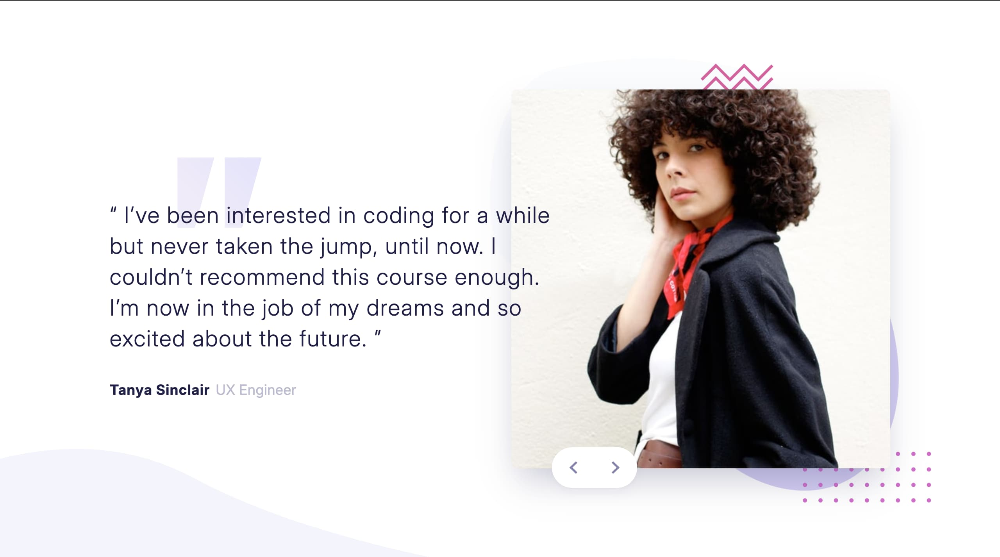

# Frontend Mentor - Coding bootcamp testimonials slider solution

This is a solution to the [Coding bootcamp testimonials slider challenge on Frontend Mentor](https://www.frontendmentor.io/challenges/coding-bootcamp-testimonials-slider-4FNyLA8JL). Frontend Mentor challenges help you improve your coding skills by building realistic projects.

## Table of contents

- [Overview](#overview)
  - [The challenge](#the-challenge)
  - [Screenshot](#screenshot)
  - [Links](#links)
- [My process](#my-process)
  - [Built with](#built-with)
  - [What I learned](#what-i-learned)
- [Author](#author)

## Overview

### The challenge

Users should be able to:

- View the optimal layout for the component depending on their device's screen size.
- Navigate the slider using either their mouse/trackpad or keyboard.
- **Animated Transitions**: Experience smooth, soft enter and exit animations when switching slides.
- **Data-Driven UI**: Render testimonials dynamically from a decoupled data source.

### Screenshot

### Links

- Solution URL:(https://www.frontendmentor.io/solutions/test-lT651CYKMu)
- Live Site URL:(https://coding-bootcamp-testimonials-slider-two-delta.vercel.app/)

## My process

### Built with

- **Semantic HTML5 markup**: Clean and accessible document structure.
- **Tailwind CSS**: For efficient, utility-first styling.
- **React**: For a modular, component-based architecture.
- **Custom Hooks**: Clean separation of slider logic from the UI.
- **CSS Animations**: For smooth transition effects between slides.

### What I learned

For this project, my primary focus was on writing clean, scalable React architecture rather than just building a static UI. I wanted to build a component that is truly reusable and production-ready.

1. **Separation of Concerns:** I kept the UI clean by moving the slider logic (handling current index, next/previous functions, and direction tracking) into a custom hook. This kept my components focused solely on rendering rather than state management.

2. **Data-Driven Architecture:** To make the component dynamic, I decoupled the testimonial data from the design. The slider feeds on a separate data file, meaning you can update, add, or remove testimonials without ever needing to touch the component's internal structure.

3. **Smooth Animations:** I implemented soft, animated transitions to enhance the user experience. Syncing the React state with CSS animations ensured the enter and exit motions felt fluid and natural when the user interacts with the controls.

## Author

- Frontend Mentor - [https://www.frontendmentor.io/profile/firoozehImany](https://www.frontendmentor.io/profile/firoozehImany)
- LinkedIn - [@firoozehimany](https://www.linkedin.com/in/firoozehimany/)